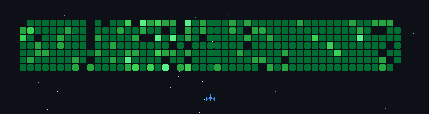

<!--
**SmilingPixel/SmilingPixel** is a ✨ _special_ ✨ repository because its `README.md` (this file) appears on your GitHub profile.

Here are some ideas to get you started:

- 🔭 I’m currently working on ...
- 🌱 I’m currently learning ...
- 👯 I’m looking to collaborate on ...
- 🤔 I’m looking for help with ...
- 💬 Ask me about ...
- 📫 How to reach me: ...
- 😄 Pronouns: ...
- ⚡ Fun fact: ...
-->

# 💫 About Me:
I’m a passionate developer with a love for solving problems and building meaningful projects, currently pursuing my Master’s degree at Fudan University.

🔭 I’m currently working on development and testing of backend systems and APIs.

🤔 I’m looking for help with diving deeper into distributed systems and optimizing backend performance.

📫 How to reach me: Feel free to email me at xunzhou24@m.fudan.edu.cn .

<!-- Generated using https://profilinator.rishav.dev/ -->

# 💻 Tech Stack:

  
  
  
  
  
  
  
  

  

   

# 🔍 Github Stats

<table><tr><td valign="top" width="50%">

<!--  -->

</td><td valign="top" width="50%">

<!--  -->

</td></tr></table>  

   

  

   

  
  

   

 

----

Generated using <a href="https://profilinator.rishav.dev/" target="_blank">Github Profilinator</a>

----

<!-- See https://github.com/czl9707/gh-space-shooter -->

